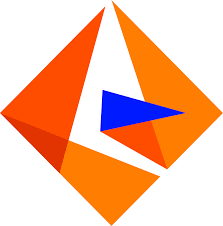

<code></code>
<code></code>

Paintings by <a href="https://en.wikipedia.org/wiki/Carl_Spitzweg">Carl Spitzweg

___
## About Me 👋
I am a **Current Masters Student in Computer Science and Engineering** at the **University of Notre Dame** 🏰. My current interests are in digital humanities and human-computer interaction.

___
## Education 🎓
- **M.S. in Computer Science and Engineering (In Progress)** - University of Notre Dame ☘️
- **B.S. in Computer Science and Mathematics** - Samford University

___
## Certifications 📜

Data Analysis with Python - <em>freeCodeCamp(🔥)</em> (In Progress)

<a href="https://www.freecodecamp.org/certification/IncredibleMelon/scientific-computing-with-python-v7">Scientific Computing with Python Certificate</a> – <em>freeCodeCamp(🔥)</em> (May 2024)

___
## Languages and Tools 🛠️
Python, Java, SQL, Flutter, Dart

<code></code>
<code></code>
<code></code>

PyCharm, IntelliJ, Informatica Tools, AWS, Visual Studio Code, Google Collaboratory

<code></code>
<code></code>
<code></code>
 
<code></code>
<code></code>
<code></code>

<!--
**matt0681/matt0681** is a ✨ _special_ ✨ repository because its `README.md` (this file) appears on your GitHub profile.

Here are some ideas to get you started:

- 🔭 I’m currently working on ...
- 🌱 I’m currently learning ...
- 👯 I’m looking to collaborate on ...
- 🤔 I’m looking for help with ...
- 💬 Ask me about ...
- 📫 How to reach me: ...
- 😄 Pronouns: ...
- ⚡ Fun fact: ...
-->

