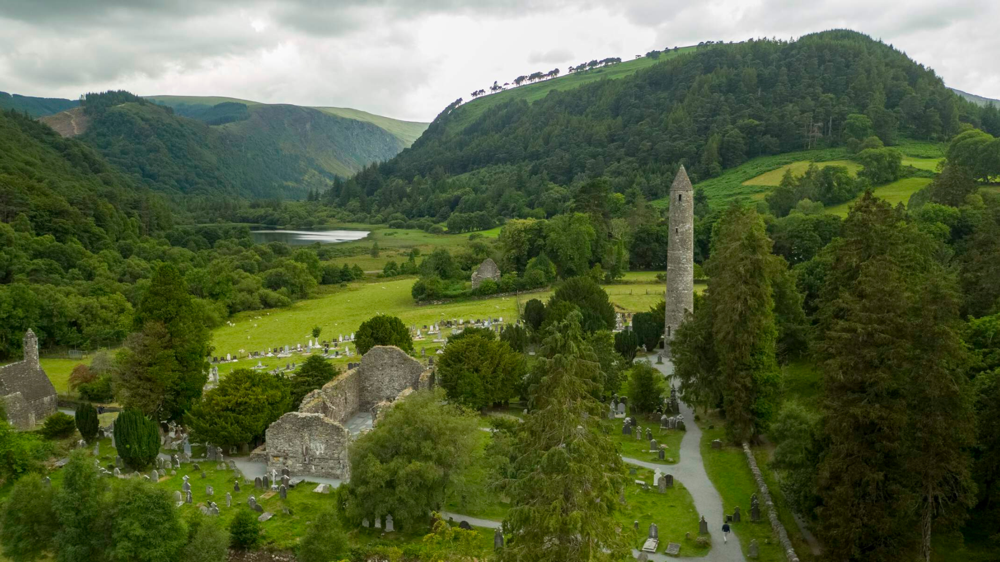

  
  
  

(Paintings by: <a href="https://en.wikipedia.org/wiki/Carl_Spitzweg">Carl Spitzweg</a> | Location: <a href="https://en.wikipedia.org/wiki/Glendalough">Glendalough, Ireland</a>)

___
## About Me 👋
I am a **Current Masters Student in Computer Science and Engineering** at the **University of Notre Dame** 🏰. My current interests are in data-science, digital humanities, and human-computer interaction.

___
## Education 🎓
- **M.S. in Computer Science and Engineering (In Progress)** - University of Notre Dame ☘️
- **B.S. in Computer Science and Mathematics** - Samford University

___
## Certifications 📜

Data Analysis with Python - <em>freeCodeCamp(🔥)</em> (In Progress)

<a href="https://www.freecodecamp.org/certification/IncredibleMelon/scientific-computing-with-python-v7">Scientific Computing with Python Certificate</a> – <em>freeCodeCamp(🔥)</em> (May 2024)

___
## Languages and Tools 🛠️
Python, Java, SQL, Flutter, Dart, React

  
  
  
  

Visual Studio Code, PyCharm, IntelliJ, Informatica Tools, AWS, Google Collaboratory

<code></code>
<code></code>
<code></code>
<code></code>
<code></code>
<code></code>

___
## Projects 🚀

<a href='https://github.com/dmsmiley/Predicting-Salaries'><strong>📈 Classifying and Predicting Salaries</strong></a>

 
<strong>Skills</strong>
<ul>
  <li>Comparing classification machine learning algorithms: Logistic Regression, Decision Tree, Naive Bayes, and K-Nearest Neighbors</li>
  <li>Visualizing confusion matrices and AUROC</li>
</ul>
<strong>Python Libraries</strong>
<ul>
  <li>Pandas</li>
  <li>NumPy</li>
  <li>Seaborn</li>
  <li>Scikit-Learn</li>
  <li>MatplotLib</li>
</ul>

<a href='https://github.com/dmsmiley/Italian_Restaurant_Review_Boston'><strong>🍝 Italian Restaurant Reviews - Boston</strong></a>

 
<strong>Skills</strong>
<ul>
  <li>Scrape restaurant reviews from FourSquare API</li>
  <li>Capture GeoJSON data from Boston Open Data</li>
</ul>
<strong>Python Libraries</strong>
<ul>
  <li>Pandas</li>
  <li>NumPy</li>
  <li>BeautifulSoup</li>
  <li>Folium</li>
  <li>MatplotLib</li>
  <li>GeoPy</li>
</ul>

<a href='https://github.com/dmsmiley/USS_Indianapolis'><strong>⚓ Surviving the USS Indianapolis with Machine Learning (In Progress)</strong></a>

 
<strong>Skills</strong>
<ul>
  <li>Working with local archivists to collect and clean data</li>
  <li>Training and testing machine learning models</li>
  <li>Using logistic regression to predict survivability</li>
</ul>
<strong>Python Libraries</strong>
<ul>
  <li>Pandas</li>
  <li>NumPy</li>
  <li>MatplotLib</li>
  <li>Seaborn</li>
  <li>Scikit-Learn</li>
</ul>

___
## Let's Connect 🌐

 
 
 

___

