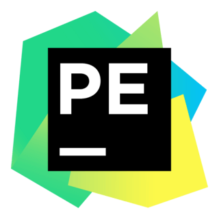

  
  
  

(Paintings by: <a href="https://en.wikipedia.org/wiki/Carl_Spitzweg">Carl Spitzweg</a> | Location: <a href="https://en.wikipedia.org/wiki/Glendalough">Glendalough, Ireland</a>)

___
## About Me
I am a **Current Masters Student in Computer Science and Engineering** at the **University of Notre Dame**. My current interests are in data-science, digital humanities, and human-computer interaction.

___
## Education
- **M.S. in Computer Science and Engineering (In Progress)** - University of Notre Dame
- **B.S. in Computer Science and Mathematics** - Samford University

___
## Languages and Tools
Python, Java, SQL, Flutter, Dart, React

  
  
  
  
  
  

Visual Studio Code, PyCharm, IntelliJ, Informatica Tools, AWS, Google Collaboratory

  
  
  
  
  
  

___
## Projects

  

    <a href='https://github.com/matt0681/GPG_Tool)'><strong>Gender Pay Gap Reporting Tool</strong></a>
  

  

  A website which generates a gender pay gap assessment report based on a company's payroll data.
  
  &nbsp;&nbsp;&nbsp;&nbsp;Tools: Python, Streamlit, Data Analysis, Mathematics, Payroll, Human Resources

  

    <a href='https://github.com/matt0681/Data-Science-Project'><strong>Movie Revenue Predictor</strong></a>
  

   
  
  <strong>Skills</strong>
  <ul>
    <li>Utilized a wide range of Machine Learning and AI techniques applied to data analytics.</li>
    <li>Practiced data science methods in normalization, data cleaning, and basic statistical methods.</li>
    <li>Implemented Streamlit for an interactive movie predictor tool.</li>
    <li>Successfully worked as a team to complete and present the project.</li>
  </ul>
  
  <strong>Python Libraries</strong>
  <ul>
    <li>Streamlit</li>
    <li>Pandas</li>
    <li>MatplotLib</li>
    <li>NumPy</li>
  </ul>
   

  

    <a href='https://github.com/matt0681/Addiction-Recovery-App'><strong>Addiction Recovery Tracking App</strong></a>
  

   
  
  <strong>Skills</strong>
  <ul>
    <li>Learned and implemented the development cycle for mobile applications.</li>
    <li>Designed and built a working mobile application.</li>
    <li>Gained a better understanding of addiction and appreciation for recovery efforts.</li>
  </ul>
  
  <strong>Tools Used:</strong>
  <ul>
    <li>Flutter</li>
    <li>Dart</li>
    <li>Android Studio</li>
  </ul>
   

  

    <a href=''><strong>AI Author Identifier and Imitator</strong></a>
  

   
  
  <strong>Skills</strong>
  <ul>
    <li>Learned and implemented various techniques in stylometry (author detection).</li>
    <li>Experimented with various large language models (LLMs) and generative AI models.</li>
    <li>Successfully trained a model to detect and imitate author styles in writing.</li>
  </ul>
  
  <strong>Python Tools</strong>
  <ul>
    <li>Streamlit</li>
    <li>OpenAI</li>
    <li>Llama</li>
    <li>DeepSeek</li>
    <li>Pandas</li>
    <li>MatplotLib</li>
    <li>NumPy</li>
  </ul>
   

  

    <a href='https://github.com/matt0681/In-Her-Shoes-Simulation'><strong>In Her Shoes - Domestic Violence Response Training Program</strong></a>
  

   
  
  <strong>Skills</strong>
  <ul>
    <li>Collaborating with human resource and information technology teams.</li>
    <li>Formulating statistical models and data analysis methods for understanding gender pay gaps.</li>
    <li>Visualizing payroll data in intuitive ways.</li>
  </ul>
  
  <strong>Python Libraries</strong>
  <ul>
    <li>Streamlit</li>
    <li>Pandas</li>
    <li>MatplotLib</li>
    <li>NumPy</li>
  </ul>
   

  

    <a href='https://github.com/matt0681/Databases-Course-Project'><strong>National Quidditch Leagure Database</strong></a>
  

   
  
  <strong>Skills</strong>
  <ul>
    <li>Collaborating with human resource and information technology teams.</li>
    <li>Formulating statistical models and data analysis methods for understanding gender pay gaps.</li>
    <li>Visualizing payroll data in intuitive ways.</li>
  </ul>
  
  <strong>Python Libraries</strong>
  <ul>
    <li>Streamlit</li>
    <li>Pandas</li>
    <li>MatplotLib</li>
    <li>NumPy</li>
  </ul>
   

##### Many more here in GitHub!

___
## Let's Connect

